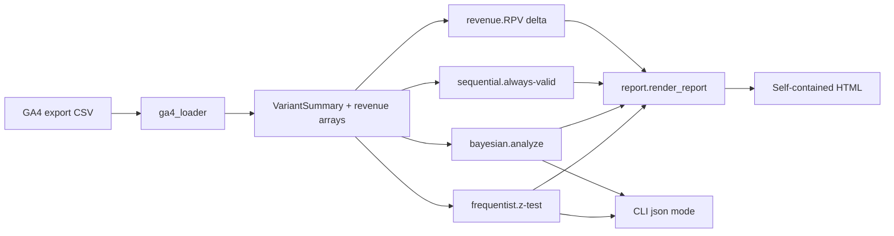

# ab-test-significance-toolkit

   

> An agency-grade A/B test analyzer for Mehran Moghadasi — Bayesian + Frequentist + Sequential significance, revenue uplift, GA4 export ingest, and exec-ready HTML reports in a single CLI.

```
Mockup — terminal + HTML report side-by-side

┌──────────────────────────────────────────────┐   ┌─────────────────────────────────────────┐
│ $ abtest analyze --csv exp.csv \             │   │  A/B Test Report: Checkout CTA copy v1  │
│        --treatment v1 --client "Acme Co."    │   │  ───────────────────────────────────    │
│                                              │   │  [ SHIP TREATMENT ]  Evidence is        │
│ Summary — Checkout CTA copy v1               │   │  strong from at least two methods.      │
│ ─────────────────────────────────────        │   │                                         │
│  Control rate            3.96%               │   │  Control rate     3.96%                 │
│  Treatment rate          4.54%               │   │  Treatment rate   4.54%                 │
│  Relative lift          +14.65%              │   │  Relative lift   +14.65%                │
│  Freq p-value (2-sided)  0.0036              │   │  P(T > C)         97.4%                 │
│  P(T > C) Bayesian       97.4%               │   │                                         │
│  Always-valid p-value    0.0091              │   │  Annualized impact  +$248,400           │
│  Sequential decision     ship                │   │  ( range +$112,200 to +$384,600 )       │
│  RPV diff           +$0.1035                 │   │                                         │
│  Annualized impact  +$248,400                │   │  Always-valid p = 0.0091  | decision: ship
│ ─────────────────────────────────────        │   │                                         │
│ Report written: reports/acme_v1.html         │   └─────────────────────────────────────────┘
└──────────────────────────────────────────────┘
```

## The Problem

Most online A/B calculators stop at the question "is the conversion rate
difference significant?" — they ask for two numbers, return a p-value, and call
it a day. That isn't enough for an agency CRO program. Analysts routinely:

- run frequentist tests they peek at daily (inflating Type-I error),
- stop tests early on the first "significant" p-value,
- report only conversion-rate uplift, ignoring revenue and AOV,
- and rebuild client reports by hand every time.

Discussions in CRO communities ([CXL](https://cxl.com/ab-test-calculator/),
practitioner threads on `r/marketing` and `r/SEO`) flag these patterns repeatedly.
This toolkit is the consolidated workflow.

## The Solution

A single Python package + CLI that runs the whole analysis chain:

1. **Sample size up-front** — kill underpowered tests before they launch.
2. **Frequentist + Bayesian + Sequential** results in one pass.
3. **Revenue impact** in the same call, annualized at a forecast traffic level.
4. **Exec-ready HTML report** that an account manager can email without edits.

## Features

- Two-proportion z-test with both pooled & unpooled standard errors and 95% CIs.
- Bayesian Beta-Binomial posterior with `P(T>C)`, expected uplift, expected loss,
  and credible intervals via 100k-sample Monte Carlo.
- Always-valid p-values via the **mSPRT** construction so analysts can peek at
  the dashboard without inflating Type-I error.
- Welch t-test for continuous metrics (RPV, AOV, time-on-page).
- Sample-size calculator accepting either relative or absolute MDE.
- Revenue impact via delta method + bootstrap CI, annualized to a forecast traffic level.
- GA4 CSV loader with permissive column-mapping and de-dup of repeat sessions.
- Single self-contained HTML report — no external CSS/JS, prints clean to PDF.
- `click`-powered CLI + plain-old programmatic API.
- Type-hinted, tested with `pytest`, MIT-licensed.

## Architecture



Every analysis is a pure function of the input CSV — no DB, no server, no
hidden state. Each module is independently importable from Python.

## Tech Stack

- **Language**: Python 3.9+
- **Core**: `numpy`, `scipy`, `pandas`
- **CLI**: `click` + `rich`
- **Reports**: `jinja2` with embedded template
- **Tests**: `pytest`

## Installation

```bash
# from source
git clone https://github.com/mehranmoghadasi/ab-test-significance-toolkit.git
cd ab-test-significance-toolkit
pip install -e ".[dev]"

# verify
abtest --version
pytest
```

## Usage

```bash
# 1. plan a test
abtest sample-size --baseline 0.04 --mde 0.10 --power 0.8

# 2. peek-safe daily check
abtest peek --c-visitors 5000 --c-conv 200 --t-visitors 5000 --t-conv 230

# 3. full analysis + HTML report
abtest analyze \
  --csv examples/sample_ga4_export.csv \
  --treatment v1 \
  --client-name "Acme Co." \
  --experiment-name "Checkout CTA copy v1" \
  --annual-traffic 2400000 \
  --out reports/acme_v1.html
```

See [`docs/USAGE.md`](docs/USAGE.md) for the programmatic Python API.

## Sample Output

```
Summary — Checkout CTA copy v1
─────────────────────────────────────
  Control rate            3.96%
  Treatment rate          4.54%
  Relative lift          +14.65%
  Freq. p-value (2-sided) 0.0036
  P(T > C) Bayesian       97.4%
  Always-valid p-value    0.0091
  Sequential decision     ship
  RPV diff           +$0.1035
  Annualized impact  +$248,400
─────────────────────────────────────
Report written: reports/acme_v1.html
```

## Roadmap

1. Multi-variant (k > 2) test mode with multiple-comparison correction.
2. CUPED variance reduction for pre-experiment covariates.
3. Server-side GA4 BigQuery export connector (skip the CSV step).
4. PDF export via `weasyprint` for one-command client deliverables.
5. White-label theming for agency-branded reports.
6. Stratified analysis by traffic source / device / geo.

## Project Structure

```
ab-test-significance-toolkit/
├── README.md
├── LICENSE
├── pyproject.toml
├── src/
│   └── ab_test_toolkit/
│       ├── __init__.py
│       ├── frequentist.py
│       ├── bayesian.py
│       ├── sequential.py
│       ├── revenue.py
│       ├── ga4_loader.py
│       ├── report.py
│       └── cli.py
├── tests/
│   ├── test_frequentist.py
│   ├── test_bayesian.py
│   └── test_sequential.py
├── docs/
│   ├── ARCHITECTURE.md
│   ├── USAGE.md
│   └── screenshots/README.md
└── examples/
    └── sample_ga4_export.csv
```

## Contributing

Issues and PRs welcome. Please run `pytest` before sending changes — the test
suite covers the statistical correctness boundary that the rest of the toolkit
relies on.

## License

[MIT](LICENSE) — use freely in commercial and agency work.

## About the Author

Built by [Mehran Moghadasi](https://github.com/mehranmoghadasi) — Digital
Marketing Manager with 13 years of agency experience across 30+ accounts in
Google Ads, Meta Ads, SEO, GA4, and GTM. Based in Edmonton, AB.
