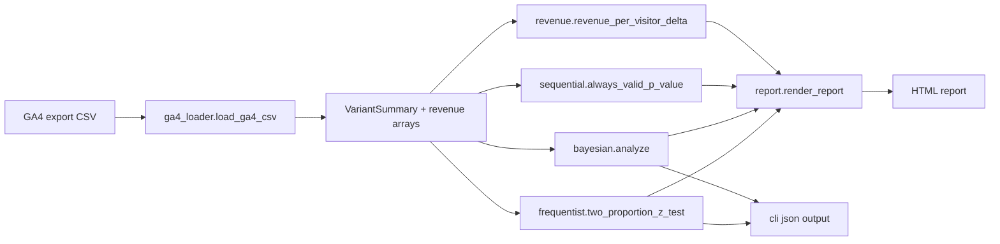

# Architecture

`ab-test-significance-toolkit` is a single-process Python library with a CLI
front door. It has no servers, queues, or persistent state — every analysis is
re-derived from raw experiment data.

## Module map

| Module | Responsibility |
| --- | --- |
| `frequentist` | Two-proportion z-test, Welch t-test, MDE → sample-size calculator. |
| `bayesian` | Conjugate Beta-Binomial posterior, Monte Carlo `P(T > C)`, expected loss. |
| `sequential` | Always-valid p-values via mSPRT for peek-safe monitoring. |
| `revenue` | RPV difference via delta method, bootstrap CIs, annualized impact. |
| `ga4_loader` | Reads a GA4-style per-session CSV into variant summaries + revenue arrays. |
| `report` | Jinja2 + embedded template that renders a single self-contained HTML exec report. |
| `cli` | `click`-powered CLI exposing `analyze`, `sample-size`, `peek`, `json`. |

## Data flow

## Tradeoffs

- **Single-file template instead of an asset directory.** The Jinja template is
  embedded so the package has zero non-PyPI dependencies for rendering. We
  trade designer-friendliness for portability — agencies can email or attach the
  HTML report directly without bundling files.
- **Monte Carlo Bayesian (100k samples by default) over closed-form.** A closed-form
  exists for the Beta-Beta difference but the Monte Carlo path lets us reuse the same
  pipeline for expected-loss decision rules, multi-variant extensions, and
  posterior predictives. 100k samples is overkill for two-arm tests but cheap.
- **mSPRT with Gaussian mixing** (instead of a fully nonparametric Howard sequence)
  is plenty for proportion tests with cumulative-z stats and avoids brittle
  numerical integration. `tau_squared` is exposed for analysts who want to tune
  power against small vs. large effects.
- **No DB.** All persistence is the analyst's responsibility — runs are pure
  functions of inputs. This is intentional for agency use where reports often
  need to be re-run with corrected attribution and recomputed offline.
